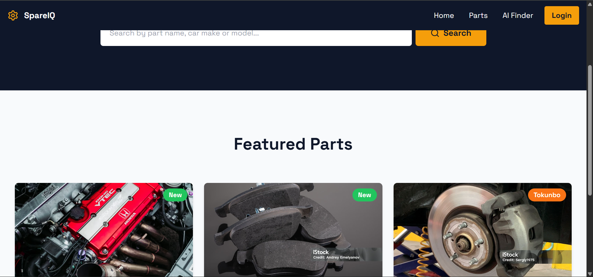

# ⚙️ SpareIQ

### AI-Powered Spare Parts Inventory & Finder Platform for the Nigerian Auto Market

🌐 **Live Demo:** [https://spareiq.netlify.app](https://spareiq.netlify.app)


---

## 📌 Overview

SpareIQ is a full stack web application that helps auto parts shops in Nigeria manage their inventory and helps customers find the exact spare part they need — even when they do not know the technical name.

The standout feature is an **AI-powered part finder** that understands descriptions in plain English and Nigerian Pidgin. A user can type something like *"the thing wey dey stop my Toyota Camry when I press the pedal"* and SpareIQ will identify it as **Brake Pads**, categorise it, and search the live inventory for matching parts — all in seconds.

This project was built as a portfolio piece to demonstrate real world frontend engineering skills using a modern React stack, connected to a live database and deployed to production.

---

## ✨ Features

### Public Storefront
- 🔍 **Smart Search** — search parts by name, car make, or model
- 🤖 **AI Part Finder** — describe a part in English or Pidgin and let AI identify it
- 🗂️ **Filter & Sort** — filter by category, condition (New / Tokunbo), and price range
- 📦 **Part Detail Pages** — full part information with related parts suggestions
- 📱 **Fully Responsive** — optimised for mobile, tablet, and desktop

### Shop Owner Dashboard (Protected)
- 🔐 **Secure Authentication** — email and password login via Firebase Auth
- 📊 **Inventory Overview** — live stats showing total parts, in-stock, and low stock alerts
- ➕ **Add New Parts** — form with Cloudinary image upload
- ✏️ **Edit Existing Parts** — update any part details or replace images
- 🗑️ **Delete Parts** — remove parts from inventory with confirmation
- 🔒 **Protected Routes** — dashboard is inaccessible without authentication

---

## 🛠️ Tech Stack

| Technology | Purpose |
|---|---|
| React 18 | UI framework |
| TypeScript | Type safety throughout |
| Tailwind CSS | Styling and responsive design |
| Vite | Build tool and dev server |
| React Router v6 | Client side routing |
| TanStack Query | Data fetching and caching |
| Firebase Auth | Shop owner authentication |
| Firestore | Real time database for parts inventory |
| Cloudinary | Image hosting and delivery |
| OpenRouter API | AI model access for part identification |
| Lucide React | Icon library |
| Netlify | Deployment and hosting |

---

## 🤖 AI Part Finder — How It Works

1. The user types a description of the part they need in any language including Nigerian Pidgin
2. SpareIQ sends the description to an AI model via OpenRouter
3. The AI identifies the technical part name, describes what it does, and suggests a category
4. SpareIQ then searches the live Firestore inventory using a keyword scoring algorithm
5. Matching parts are displayed instantly below the chat interface

This feature makes SpareIQ genuinely useful for customers who know what their car needs but not what the part is called.

---

## 🏗️ Project Architecture

This project uses a **feature-based folder structure** for scalability and maintainability:

```
src/
├── features/
│   ├── inventory/          # Part cards, grids, and inventory hooks
│   │   ├── components/
│   │   └── hooks/
│   ├── ai-finder/          # AI chat interface and matching logic
│   │   ├── components/
│   │   └── hooks/
│   └── dashboard/          # Shop owner dashboard components
│       └── components/
├── components/             # Shared UI components (Navbar, ProtectedRoute)
├── hooks/                  # Shared hooks (useAuth)
├── lib/                    # Firebase and Cloudinary configuration
├── types/                  # TypeScript interfaces (SparePart)
└── pages/                  # Route level page components
    └── dashboard/          # Dashboard pages
```

---

## 🚀 Getting Started Locally

### Prerequisites
- Node.js v18 or higher
- A Firebase project with Firestore and Authentication enabled
- A Cloudinary account with an unsigned upload preset
- An OpenRouter API key

### Installation

```bash
# Clone the repository
git clone https://github.com/mudimurtala/spareiq.git
cd spareiq

# Install dependencies
npm install

# Create your environment file
cp .env.example .env
```

### Environment Variables

Create a `.env` file in the root directory with the following keys:

```
VITE_FIREBASE_API_KEY=your_value
VITE_FIREBASE_AUTH_DOMAIN=your_value
VITE_FIREBASE_PROJECT_ID=your_value
VITE_FIREBASE_STORAGE_BUCKET=your_value
VITE_FIREBASE_MESSAGING_SENDER_ID=your_value
VITE_FIREBASE_APP_ID=your_value
VITE_CLOUDINARY_CLOUD_NAME=your_value
VITE_CLOUDINARY_UPLOAD_PRESET=your_value
VITE_OPENROUTER_API_KEY=your_value
```

### Run the Development Server

```bash
npm run dev
```

Open [http://localhost:5173](http://localhost:5173) in your browser.

---

## 📸 Pages

| Page | Route | Description |
|---|---|---|
| Home | `/` | Hero section and featured parts grid |
| Parts Listing | `/parts` | All parts with search and filters |
| Part Detail | `/parts/:id` | Full part info and related parts |
| AI Finder | `/ai-finder` | Chat interface for AI part identification |
| Login | `/login` | Shop owner authentication |
| Dashboard | `/dashboard` | Inventory overview and stats |
| Manage Inventory | `/dashboard/inventory` | Full parts table with edit and delete |
| Add Part | `/dashboard/inventory/new` | Form to add a new part with image upload |
| Edit Part | `/dashboard/inventory/:id/edit` | Form to update an existing part |

---

## 💡 Key Design Decisions

**Nigerian Market Focus** — Part conditions are categorised as New or Tokunbo (fairly used), which is the terminology used in Nigerian auto markets. Prices are displayed in Nigerian Naira (₦).

**AI in Plain Language** — The AI system prompt is specifically tuned for Nigerian Pidgin English, making the tool accessible to mechanics and car owners who may not know technical part names.

**Honest Inventory Matching** — The matching algorithm uses a keyword scoring system rather than simple category matching, ensuring only genuinely relevant parts are shown. No results is shown instead of a wrong result.

**Mobile First** — All components were built mobile-first using Tailwind responsive prefixes, ensuring the app works well for customers browsing on mobile phones.

---

## 👨‍💻 Author

**Mudi** — Self-taught developer and member of Learn2Earn NG, a campus-style learning community focused on AI-native software engineering.

- GitHub: [@mudimurtala](https://github.com/mudimurtala)

---

## 📄 License

This project is open source and available under the [MIT License](LICENSE).
